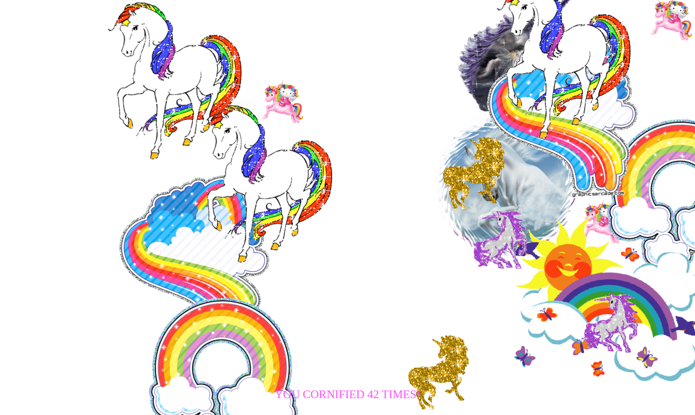

# 12-Key-Sequence-Detection

## Project link

## Guides

- Le but de ce défi est de générer un nouvel effet Cornify lorsque le "Mot de
  passe", une chaîne de caractère prédéfinies, est découverte.
- Utilisateurs écrivent piseth comme mot de passe pour générer un nouvel effet Cornify

## Application Layout

